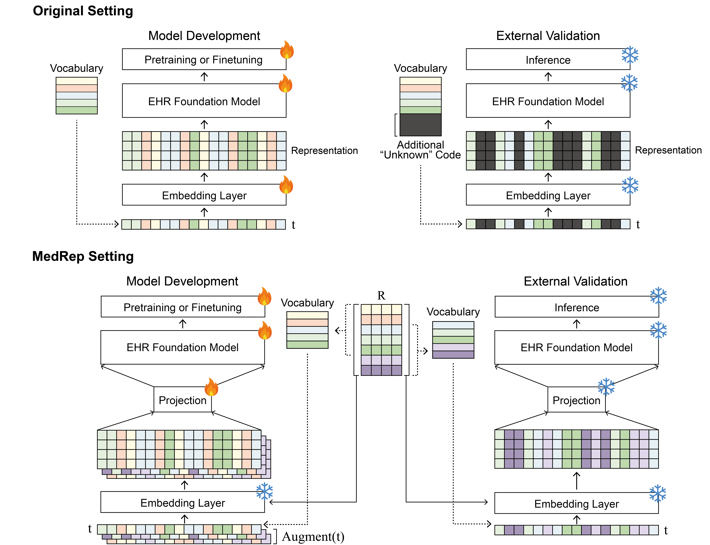

# MedRep

The official source code for MedRep.

## Abstract
Electronic health record (EHR) foundation models have been an area ripe for exploration with their improved performance in various medical tasks. Despite the rapid advances, there exists a fundamental limitation: Processing unseen medical codes out of the vocabulary. This problem limits the generality of EHR foundation models and the integration of models trained with different vocabularies. To deal with this problem, we propose MedRep for EHR foundation models based on the observational medical outcome partnership (OMOP) common data model (CDM), providing the integrated medical concept representations and the basic data augmentation strategy for patient trajectories. For concept representation learning, we enrich the information of each concept with a minimal definition through large language model (LLM) prompts and enhance the text-based representations through graph ontology of OMOP vocabulary. Trajectory augmentation randomly replaces selected concepts with other similar concepts that have closely related representations to let the model practice with the concepts out-of-vocabulary. Finally, we demonstrate that EHR foundation models trained with MedRep better maintain the prediction performance in external datasets. The concept representation NumPy files (.npy) and index files (.csv) can be downloaded [here](https://dl.dropboxusercontent.com/scl/fi/dz5pkp03s7tiz7r37zqtn/concept_representation_v1.0.zip?rlkey=s22bx5wx5wgzi0cs05xi0iyfn&st=r9rhi5n1&dl=0).

**Illustration of Concept Representation Learning**
<br/>
<p align="center"></p>
<br/>

**Illustration of Trajectory Augmentation**
<br/>
<p align="center"></p>
<br/>


## Data Preparation
|Dataset|Details|URL|
|------|---|---|
|OMOP Vocabulary|2 Files are required: <br> - CONCEPT.csv <br> - CONCEPT_RELATIONSHIP.csv|https://athena.ohdsi.org/|
|MIMIC-IV 2.2|The original data should be converted to OMOP CDM format. <br> 8 Files are required: <br> - patients.csv (original) <br> - condition_occurrence.csv <br> - drug_exposure.csv <br> - measurement.csv <br> - procedure_occurrence.csv <br> - visit_occurrence.csv <br> - person.csv <br> - death.csv |https://physionet.org/content/mimiciv/2.2/|
|EHRSHOT|7 Files are required: <br> - condition_occurrence.csv <br> - drug_exposure.csv <br> - measurement.csv <br> - procedure_occurrence.csv <br> - visit_occurrence.csv <br> - person.csv <br> - death.csv <br>  |https://redivis.com/datasets/53gc-8rhx41kgt|

**File tree for data is as follows:**
```bash
.
├── codes
├── data
│   ├── concepts
│   │   ├── CONCEPT.csv
│   │   └── CONCEPT_RELATIONSHIP.csv
│   ├── ehrshot
│   │   ├── condition_occurrence.csv
│   │   ├── death.csv
│   │   ├── drug_exposure.csv
│   │   ├── measurement.csv
│   │   ├── person.csv
│   │   ├── procedure_occurrence.csv
│   │   └── visit_occurrence.csv
│   └── mimic
│       ├── condition_occurrence.csv
│       ├── death.csv
│       ├── drug_exposure.csv
│       ├── measurement.csv
│       ├── patients.csv
│       ├── person.csv
│       ├── procedure_occurrence.csv
│       └── visit_occurrence.csv
├── usedata
├── results
..
```


## Requirements
```bash
- Python 3.9.19
- torch 2.6.0
- transformers 4.49.0
- torch-geometric 2.6.1
- torch_scatter 2.1.2
- torch_sparse 0.6.18
```


## How to Run
**Data Preprocessing**
```bash
cd ./codes
bash preprocessing/run.sh
```

**Learning Representations**
```bash
cd ./codes
bash representation/run.sh
```

**Model Pretraining**
```bash
cd ./codes
python baselines/experiments_pretraining.py --hospital [mimic] --model [behrt] --rep-type [description+gnn] --multi-gpu --gpu-devices [0 1 2 3 4 5 6 7]
```

**Model Finetuning** <br>
Without trajectory augmentation:
```bash
cd ./codes
python baselines/experiments_finetuning.py -d [0] --hospital [mimic] --model [behrt] --rep-type [description+gnn] --outcome [MT]
```
With trajectory augmentation (augmentation factor of 10):
```bash
cd ./codes
python baselines/experiments_finetuning.py -d [0] --hospital [mimic] --model [behrt] --rep-type [description+gnn] --outcome [MT] --aug --aug-times [10]
```
